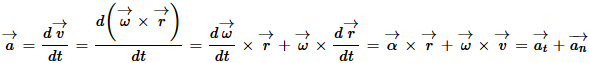
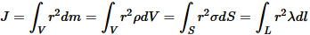
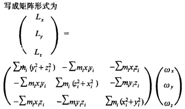

# 刚体力学

* 刚体（rigid body）
* 刚体运动：平动（translation）、转动（rotation）
* 圆周运动 circular motion
* 角位移 angular displacement 单位（弧度rad）
* 角速度 angular velocity 矢量，方向沿转轴向上或向下，由右手螺旋法则确定；用 $\vec \omega $ 表示，单位（$rad \cdot \{s^\{ \- 1\}\}$）
* $\vec v = \vec \omega  \times \vec r$
* 角加速度（angular acceleration）：$\vec \alpha  = \frac\{\{d\vec \omega \}\}\{\{dt\}\}$
	
* 质元（element of mass）：dm
* 转动惯量（moment of inertia）J：标量，类似于质量，是刚体转动惯性的量度；单位（$kg \cdot \{m^2\}$）；r为质元dm至转轴的距离
	
* 回旋半径（radius of gyroration）$\{r\_G\}$：又称惯性半径，将刚体全部质元集中于某一等效点（非质心），该点到转轴的距离
	$J = mr\_G^2$
* 平行轴定理（parallel axis theorem）：如果刚体对通过其质心的某一转轴的转动惯量为 $\{J\_C\}$，则该轴平移一段距离d后，转动惯量变为$J = \{J\_C\} \+ m\{d^2\}$（可数学推导）
* 刚体定轴转动时的角动量（$\{\vec \omega \}$方向必须与轴一致）：$\overrightarrow L  = J\vec \omega $
* 力矩做功：力矩的空间积累效应
	$W = \int\_0^\theta  \{Md\theta \}$
	$P = M\omega$
* 刚体定轴转动动能：
	${E_k} = \frac{1}{2}J{\omega ^2}$
* 刚体绕定轴转动的动能定理：刚体转动动能的增量 = 合外力矩对刚体所做的功
* **刚体定点转动：绕固定点转动的刚体只有一点不动，而其余各点则分别在以该固定点为中心的同心球面上运动。**
	* 瞬时角速度：定点转动刚体的任何有限位移可用绕某轴的一次转动来实现，该轴通过刚体的固定点。假设该瞬时轴为OP，在短暂的时间间隔$\Delta t$内，刚体绕轴OP转过一微小角度$\Delta \theta $，称为角位移，它具有矢量的性质，可按平行四边形规则相加。$\Delta t$趋向于零时，$\Delta \theta $趋于一个极限方向，$\Delta \theta $与$\Delta t$之比也趋于一个极限值${\vec \omega }$。矢量${\vec \omega }$称为刚体在瞬时t的角速度。
	* 瞬轴锥面：随着时间的推移，刚体的瞬时轴要改变位置，它在固定空间描出一个锥面，称定瞬轴锥面（即空间极锥的锥面）；同时在刚体内部也描出一个锥面，称为动瞬轴锥面（即本体极锥的锥面）。由此可得潘索定理：刚体定点转动可用动瞬轴锥面在定瞬轴锥面上的纯滚动来代替。
	* 角加速度：作定点转动的刚体角速度${\vec \omega }$通常是变量。角速度变化$\Delta \vec \omega $与对应时间间隔$\Delta t$的比值，当Δt→0时所趋至的极限值称为刚体在瞬时t的角加速度。
* 刚体定点转动时的角动量（${\vec \omega }$为瞬时角速度，方向会随时间改变，得出的角动量方向一般不同于${\vec \omega }$）：
	* $\overrightarrow L  = \sum \{\{m\_i\}\overrightarrow \{\{r\_i\}\}  \times \left\( \{\overrightarrow \omega   \times \overrightarrow \{\{r\_i\}\} \} \right\)\} $
	
	* $\overrightarrow L  = I\overrightarrow \omega  $，I就是惯性张量（三阶矩阵）
	* 惯性张量（inertia tensor）I：是种三阶矩阵，类似于质量m（平动惯性的量值），从整体的角度来看惯性张量I表示刚体绕定点转动惯性的量值，而转动惯量J表示绕定轴转动惯性的量值，即I与J都是表示刚体转动惯性的大小，详见[维基百科](http://zh.wikipedia.org/wiki/%E6%85%A3%E6%80%A7%E5%BC%B5%E9%87%8F#.E6.85.A3.E6.80.A7.E5.BC.B5.E9.87.8F)
	* I和J相互转化：
		* 设原点为O，OM为转轴，$\overrightarrow \{\{e\_\{OM\}\}\} $ 为转轴单位向量，瞬时角速度 $\{\vec \omega \}$ 同定轴转动角速度，定轴转动角动量 $\{\overrightarrow \{\{L\_\{OM\}\}\} \}$ 就是定点转动角动量L在OM上的投影：
		$$\left\| \{\overrightarrow \{\{L\_\{OM\}\}\} \} \right\| = \overrightarrow \{\{e\_\{OM\}\}\}  \cdot \vec L = \overrightarrow \{\{e\_\{OM\}\}\}  \cdot \left\( \{I\vec \omega \} \right\) = \left[ \{\overrightarrow \{\{e\_\{OM\}\}\}  \cdot \left\( \{I\overrightarrow \{\{e\_\{OM\}\}\} \} \right\)\} \right]\left\| \{\vec \omega \} \right\|$$
		等价于
		$$\overrightarrow \{\{L\_\{OM\}\}\}  = \left[ \{\overrightarrow \{\{e\_\{OM\}\}\}  \cdot \left\( \{I\overrightarrow \{\{e\_\{OM\}\}\} \} \right\)\} \right]\vec \omega  = J\vec \omega $$
		$$J = \overrightarrow \{\{e\_\{OM\}\}\}  \cdot \left\( \{I\overrightarrow \{\{e\_\{OM\}\}\} \} \right\) = \left\( \{\begin\{array\}\{\*\{20\}\{c\}\}
			  \alpha &\beta &\gamma  
			\end\{array\}\} \right\)\left\( \{\begin\{array\}\{\*\{20\}\{c\}\}
			  \{\{I\_\{xx\}\}\}&\{\{I\_\{xy\}\}\}&\{\{I\_\{xz\}\}\} \\\\ 
			  \{\{I\_\{yx\}\}\}&\{\{I\_\{yy\}\}\}&\{\{I\_\{yz\}\}\} \\\\ 
			  \{\{I\_\{zx\}\}\}&\{\{I\_\{zy\}\}\}&\{\{I\_\{zz\}\}\} 
			\end\{array\}\} \right\)\left\( \{\begin\{array\}\{\*\{20\}\{c\}\}
			  \alpha  \\\\ 
			  \beta  \\\\ 
			  \gamma  
			\end\{array\}\} \right\)$$
* 刚体绕定点转动的动能 $\{E\_k\}$：（以单一质点为例）
	$$\begin\{split\}
	  \{E\_k\} &= \frac\{1\}\{2\}m\left\( \{\vec v \cdot \vec v\} \right\) \\\\ 
	   &= \frac\{1\}\{2\}m\vec v \cdot \left\( \{\vec \omega  \times \vec r\} \right\) \\\\ 
	   &= \frac\{1\}\{2\}m\vec \omega  \cdot \left\( \{\vec r \times \vec v\} \right\) \\\\ 
	   &= \frac\{1\}\{2\}\vec \omega  \cdot \vec L \\\\ 
	   &= \frac\{1\}\{2\}\vec \omega  \cdot \left\( \{I\vec \omega \} \right\) \\\\ 
	\end\{split\} $$

