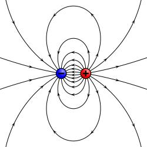

# 电偶极子

研究电偶极子的作用：将电偶极子作为电介质模型的基本元素
电偶极矩（也称电矩）：从负电荷-q到正电荷+q的距离矢量为d，则电偶极距表示为p=qd，p方向也从负电荷-q指向正电荷q，电偶极矩的物理意义是电荷系统的极性的一种衡量。

电位：
$$\varphi {\text{ = }}\frac{q}{{4\pi {\varepsilon \_0}}}\left( {\frac{1}{{{r\_{( \+ )}}}} \- \frac{1}{{{r\_{( \- )}}}}} \right) = \frac{q}{{4\pi {\varepsilon \_0}}}\left( {\frac{{{r\_{( \- )}} \- {r\_{( \+ )}}}}{{{r\_{( \+ )}}{r\_{( \- )}}}}} \right)$$

对于电偶极子，有 $R \gg d$ ，因此（ $\overrightarrow R $ 为源点-电偶极子到场点的距离矢量）

$$\varphi {\text{ = }}\frac{{q\overrightarrow d  \cdot \overrightarrow {{e\_R}} }}{{4\pi {\varepsilon \_0}{R^2}}} = \frac{{\overrightarrow p  \cdot \overrightarrow {{e\_R}} }}{{4\pi {\varepsilon \_0}{R^2}}} =  \- \frac{1}{{4\pi {\varepsilon \_0}}}\overrightarrow p  \cdot \nabla \frac{1}{R}$$

$$\overrightarrow E  =  \- \nabla \varphi  = \frac{1}{{4\pi {\varepsilon \_0}}}\nabla \left( {\overrightarrow p  \cdot \nabla \frac{1}{R}} \right)$$

电极偶子的等值线图。等值曲面清楚地区分于图内。

分开有限距离的两个异性电荷的电场线。

# 极化电荷

电介质：没有自由电荷的物质（只有极化电荷），如云母等
导体：含有自由电荷的物质
极化电荷：电介质内部分布的电偶极子的另一种表述

极化强度：电偶极子偶极矩的密度，符号P
$$\overrightarrow P \Delta V = \sum\limits\_{\Delta V} {\overrightarrow p } $$

$$d\varphi {\text{ = }}\frac{{\left( {\overrightarrow P dV} \right) \cdot \overrightarrow {{e\_R}} }}{{4\pi {\varepsilon \_0}{R^2}}} = \frac{{\overrightarrow P  \cdot \overrightarrow {{e\_R}} }}{{4\pi {\varepsilon \_0}{R^2}}}dV$$

$$\varphi {\text{ = }}\iiint\limits\_V {\frac{{\overrightarrow P  \cdot \overrightarrow {{e\_R}} }}{{4\pi {\varepsilon \_0}{R^2}}}dV}$$

电介质内电偶极子产生的电场，看成是极化电荷产生的电场

# 电位移矢量

