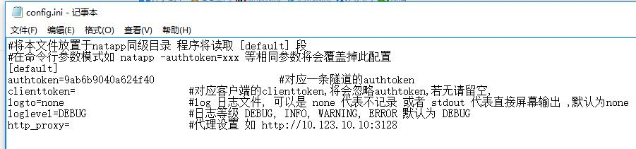

# NATAPP（稳定，随机域名）

官网：https://natapp.cn/
免费隧道(注册用户)：
一个注册用户可免费拥有2条不同协议的隧道
随机域名/TCP端口
不定时强制更换域名/端口

 **config.ini方式 (推荐)** 
根据操作系统下载不同的[config.ini文件](https://natapp.cn/article/config_ini)到刚才下载的natapp.exe同级目录
将购买隧道得到的authtoken填进去 (其他地方都不填),然后保存

windows下,直接双击natapp.exe 即可

 **cmd -authtoken= 参数方式运行** 
windows ,点击开始->运行->命令行提示符 后进入 natapp.exe的目录
运行：
```
natapp -authtoken=9ab6b9040a624f40
```


# ITTUN

官网：http://www.ittun.com/

示例.bat
```
@echo on
cd %cd%
#ngrok -proto=tcp 22
#ngrok start web
#ngrok -subdomain test1 8080
ngrok 80
```


# Yeti

官网：http://fix-cn.com/

ngrok.bat
```
start ngrok -config=ngrok.cfg -subdomain simtop 80
start ngrok -config=ngrok.cfg -subdomain 1993 1993
```


# 动酷网络科技

官网：http://ngrok.2bdata.com/

ngrok.bat
```
start ngrok -config=ngrok.cfg -subdomain simtop 80
start ngrok -config=ngrok.cfg -subdomain 1993 1993
```


# 糖果科技（较稳定）

官网：http://qydev.com/

ngrok.bat
```
start ngrok -config=ngrok.cfg -subdomain simtop 80
start ngrok -config=ngrok.cfg -subdomain 1993 1993
```


# Sunny-Ngrok内网转发（不稳定）

官网：https://www.ngrok.cc/
平台登陆地址：http://www.ngrok.cc/login


示例：
原始仓库地址：ssh://ZJZY@192.168.0.123/
内网穿透仓库地址：ssh://ZJZY@server.ngrok.cc:12345/


修改的Sunny-Ngrok启动工具.bat：
```
@echo OFF
color 0a
Title Sunny-Ngrok启动工具 by pxp1230.github.io
Mode con cols=109 lines=30
set clientid=0e1291441d17cb73
sunny.exe clientid %clientid%
```


