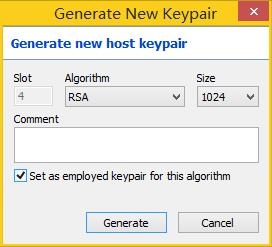
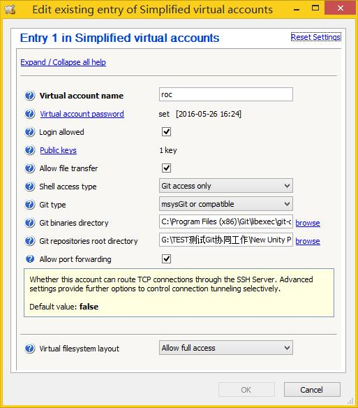
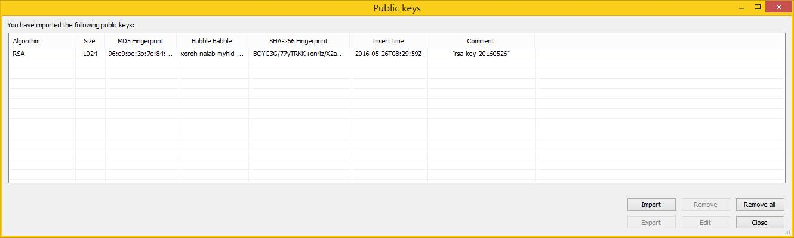
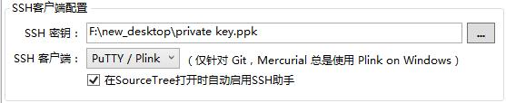

# 使用Bitvise SSH Server在Windows上建立Git服务器

1. 下载并安装Bitvise SSH Server
	官网：https://www.bitvise.com/ssh-server-download

1. 打开Bitvise SSH Server配置界面

1. 在Host Keys区域中点击 `Manage host keys` ，再点击 `Generate New...` ， 配置如下：
	

1. 在Settings区域中点击 `Open easy settings` ，设置Open Windows Firewall为 `Open port(s) to any computer` ；在Virtual accounts中添加虚拟账户，配置如下：
	
	其中Git binaries directory路径为 `C:\Program Files (x86)\Git\libexec\git-core`
	一个虚拟账户对应一个仓库，可以设置多个Public keys方便多人协作管理这个仓库：
	

1. 点击 `Start Server` 开启SSH服务

1. 在SourceTree中更改SSH客户端配置：
	

1. 在SourceTree中的Git设置为使用系统安装的Git

1. 克隆远程仓库，设置URL路径如 `ssh://roc@192.168.0.126/` ，第一次连接需要填写登录密码

1. 远程仓库需要修改git的配置文件，否则会出现git push remote error
	在remote端设置git的配置文件（.git/config），在其中添加如下内容：
```
[receive]
	denyCurrentBranch = false
```


