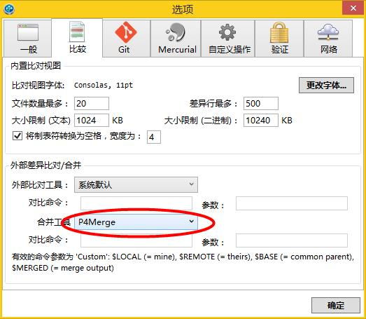
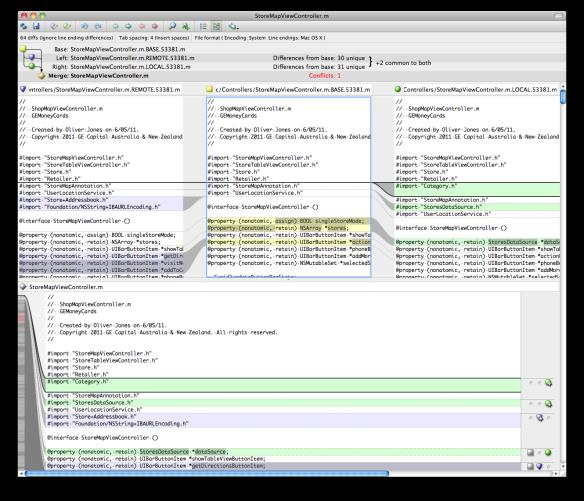

# 解决 Git 冲突的工具 - P4Merge

* 官网：https://www.perforce.com/product/components/perforce-visual-merge-and-diff-tools
* p4merge for other os：https://www.perforce.com/downloads/helix
* 文件所在路径："C:\Program Files\Perforce\p4merge.exe"

SourceTree 的作者斯蒂夫·斯特里廷和其他几个同事使用 P4Merge 来执行合并操作。P4Merge 是免费的可视化工具，它具有四个面板而不是其他工具提供的三个，显示了”base“、”local“、”remote“和”merge result“。

先安装P4Merge，再到SourceTree中设置：

* 查看更多同类工具：http://blog.jobbole.com/97911/

