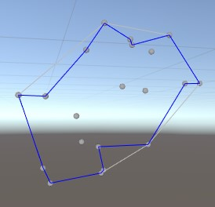

## ConcaveHull类 ##

static bool Create2D(Vector2[] points, out int[] concaveHull, float algorithmThreshold, float epsilon = 1e-005f);
static bool Create2D(Vector2[] points, out int[] concaveHull, out int[] convexHull, float algorithmThreshold, float epsilon = 1e-005f);
*algorithmThreshold：边长阈值
```
public Vector2[] _points;
private int[]    _indicesConvex;
private int[]    _indicesConcave;
private bool     _previous;
_points = GenerateMemoryRandomSet2D(GenerateRadius, GenerateCountMin, GenerateCountMax, CoeffX, CoeffY);
ConcaveHull.Create2D(_points, out _indicesConcave, out _indicesConvex, Threshold);
```
生成凹多边形网格：同顶点集合Convex化
生成的凹多边形（蓝线）：



