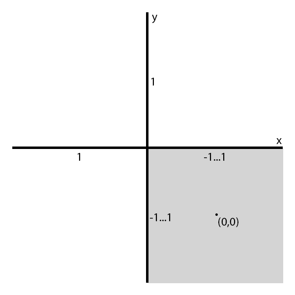
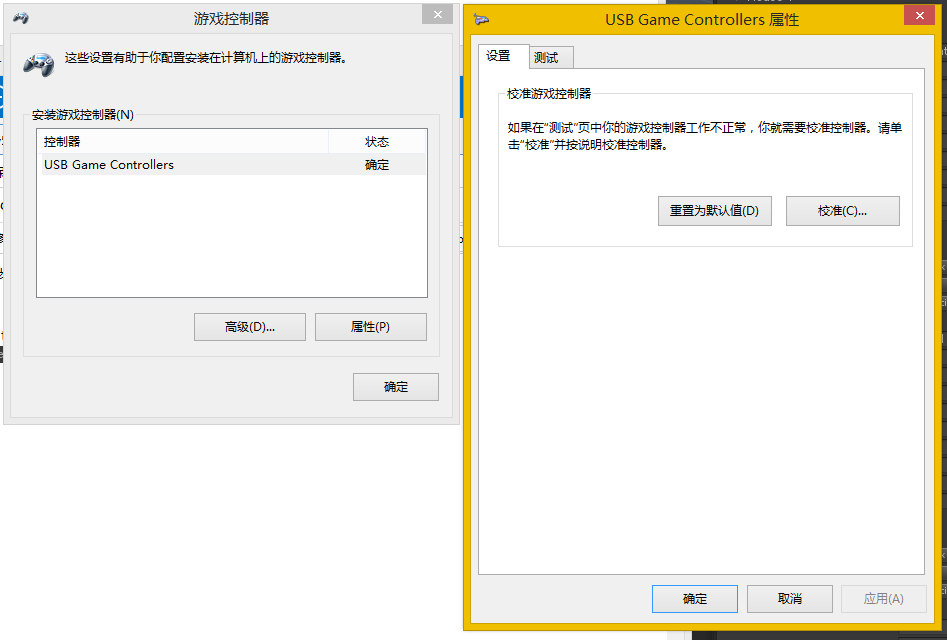
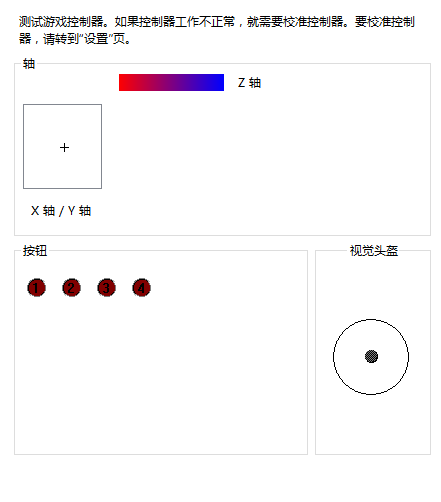

## *Windows平台Unity读取轴出错Bug涉及设备列表（解决方案：Rewired插件） ##

Thrustmaster USB Joystick
Thrustmaster F430
Logitech G940
Microsoft Sidewinder FFB 2

## 第一步：校准游戏控制器 ##

Z轴：手柄左侧滑块
X轴/Y轴：手柄
按钮1：扳机
按钮2：手柄中键
按钮3：手柄背后凸起按键
按钮4：手柄右键
视觉头盔：8方向键（手柄左键）
