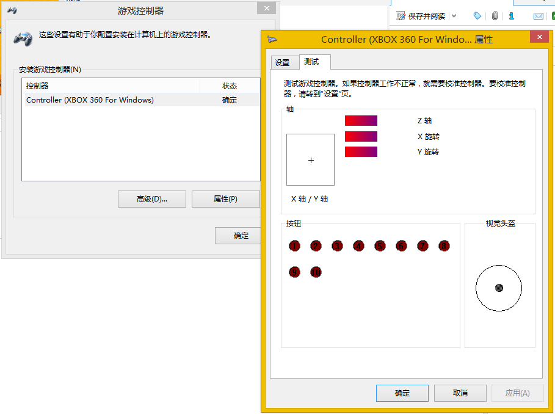
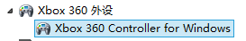

# 第一步：校准游戏控制器



```
X轴/Y轴：左手柄
X旋转：右手柄水平方向
Y旋转：右手柄垂直方向
Z轴正方向(1)：左扳机(LT)
Z轴负方向(-1)：右扳机(RT)
按钮1：A键
按钮2：B键
按钮3：X键
按钮4：Y键
按钮5：左按钮(LB)
按钮6：右按钮(RB)
按钮7：BACK键
按钮8：START键
按钮9：左手柄按键
按钮10：右手柄按键
视觉头盔：8方向键（左侧方向键）
```


# 【转载】window8系统 XBOX360 无线手柄 山寨接收器安装 WIN8 无线手柄 驱动安装

原文：http://bbs.a9vg.com/thread-3752158-1-1.html

有人说X宝上的山寨XBOX无线接收器也不知道该不该说是山寨的，其实其芯片是退休的XBOX360主机上下来的无线接收板做的，本质上也没什么大的区别。但由于主机上用的接收板硬件ID和微软自己专门出的PC接收器不一样，所以win 7 /vista插上后不会自动识别出来。

网上一直只有XP或者WIN7的山寨接收器的安装教程，WIN8系统几乎没有发，淘宝卖家也不知道怎么弄，我个人在机缘巧合之下，倒是把驱动给装上了，这还得归功于一直摸索的玩家们，也许更多人已经知道了WIN8的安装方法和WIN7的一样只是不爱发帖告之其他一直深受苦恼的玩家们，好了，各位大神已经成功过的您就当我是火星吧。也许这个教程可以帮到一些没有在WIN8系统下安装成功的小哥们。

下面我就来说下安装过程，和网上的WIN7安装程序其实是一样的，这里请允许我搬砖。

1）到微软网站下载最新的xbox360手柄驱动并安装（百度网盘/上海形拓科技有限公司/XBox360），安装过程无非就是点我同意，确定，下一步，完成只类的，简单，不多说。

下面是各系统的安装方法：
Window8、Windows 7/vsita:32位64位系统：都是一样的

插上接收器后，系统会寻找驱动，会提示找不到驱动，打开设备管理器,会发现一个未知设备点右键选更新驱动程序软件如下图：

[未知设备]

点击“浏览计算机以查找驱动程序软件/手动查找并安装驱动程序”

然后自己找到 C:\Program Files\Microsoft Xbox 360 Accessories

点击“从计算机的设备驱动程序列表中选择”

选择“XBOX360 外设”

出现不推荐这个驱动警告的时候选择“是“

然后他就会自动安装，一直安装完成


安装完成


