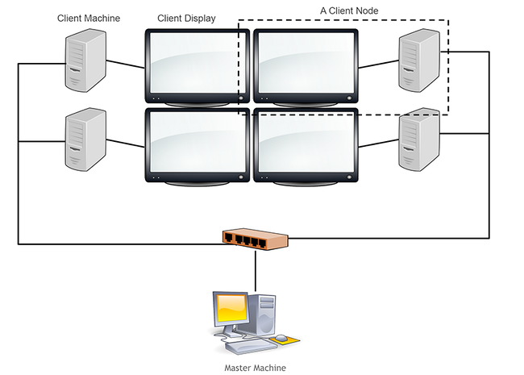

# 集群渲染概述

Unity的集群渲染技术允许多台主机同时同步地渲染同一个场景，该特性使你能将项目部署到多屏环境中，例如视频墙、CAVE等。

Unity的集群渲染技术可容纳非常多的显示设备，如果网络带宽足够的话，可以支持50个屏幕以上。

这项技术需要在所有主机中安装并运行同一个项目工程可执行文件，所有主机必须处于同一个局域网中。


# 硬件设置

一个节点由一台工作站和一个显示器组成，每台工作站运行同一个可执行文件（开启Cluster Rendering）。

下图中有一个主节点和客户端节点。客户端节点通过局域网和主节点相连。一般使用高带宽的网线连接，WiFi的速度一般不能达到要求，会导致同步不一致。



# 原理

要开启一个Cluster Rendering组，你需要通过命令行配置每一个节点的主从关系。

主节点会自动同步所有客户端节点，该方法被称作帧锁定。这意味着主节点会传播一个“update”信号给所有客户端主机在它自己的Update()中，当客户端节点“checked in”主节点时。一旦主节点发出“update”信号，它会等待直到所有客户端节点返回“checked in”信号，然后继续该循环。

主节点也可以发送长数据，例如时间、随机数种子、外设输入值。这能确保所有主机的运行效果都一致。信息同步的效率和场景复杂度无关，这意味着一个复杂的场景不会影响网络性能，只会影响单个节点的渲染性能。


# 部署一个Unity集群

以Unity Cluster模式运行可执行文件：

**Master node**：必须先开启
```
-server <number of clients> *:<pubport> *:* <timeout>
```
* number of clients 参数：客户端节点数量，不包括主节点。直到连接的客户端主机达到这个数量，主节点才会真正开始运行。
* timeout 参数：可选，用于判断等待信号的最大时长，超过这个时间就判定为连接断开。
示例：
```
ClusterTest.exe -server 2 *:20000 *:* 60 -logfile output.txt
```

**Client node**
```
-client <index> <masterip>:<pubport> <clientip>:<clientport> <timeout>
```
* index 参数：客户端节点唯一标识符。
* masterip 和 pubport 参数：主节点的IP地址和端口号，不要使用localhost，它会产生错误。
* clientip 和 clientport 参数：客户端节点的IP地址和端口号，一般使用\*代替：`*:*`
* timeout 参数：可选，用于判断等待信号的最大时长，超过这个时间就判定为连接断开。
示例：
```
ClusterTest.exe -client 1 127.0.0.1:20000 *:20000 60 -logfile output.txt
ClusterTest.exe -client 1 192.168.168.123:20000 *:* 60 -logfile output.txt
```

**附加参数**
* -force-opengl (windows only)：强制使用OpenGL渲染，即使Direct3D可用。
* -logFile <pathname>：输出调试信息到log文件。


# 针对集群的外设输入

输入只能通过主节点发送给客户端节点，你必须对Cluster Input Settings进行设置，并且打开VRPN服务来发送输入数据给所有客户端节点。


