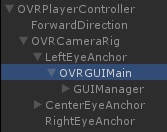

## UGUI在OculusVR中的使用 ##

界面必须加在LeftEyeAnchor下：

	void Awake(){
	    NewGUIObject = new GameObject();
	    NewGUIObject.name = "OVRGUIMain";
	    NewGUIObject.transform.parent = GameObject.Find("LeftEyeAnchor").transform;
	    RectTransform r = NewGUIObject.AddComponent<RectTransform>();
	    r.sizeDelta = new Vector2(1000f, 1000f);    //占据屏幕所有空间
	    r.localScale = new Vector3(0.001f, 0.001f, 0.001f);
	    r.localPosition = new Vector3(0, 0, 0.5f);
	    r.localEulerAngles = Vector3.zero;
	    Canvas c = NewGUIObject.AddComponent<Canvas>();
	    c.renderMode = RenderMode.WorldSpace;
	    c.pixelPerfect = false;
	}
