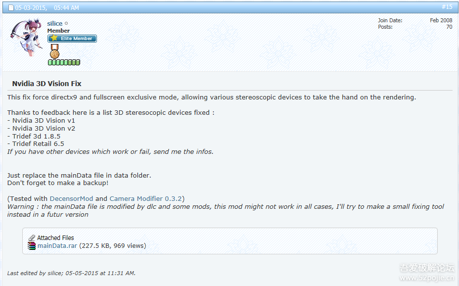

## 3D VISION立体显示器+立体眼镜 ##
Unity中设置：

	1. 在Player Settings中勾选Stereoscopic Rendering和Use Direct3D 11
	2. 发布成x86_64
	3. linear color space会出现问题
	4. forward rendering下打开实时阴影会出现

实现3D VISION需要4个基本条件：

	1. 支持3D VISION的显卡
	2. 立体环境套装（即3D眼镜和信号发射器）
	3. 支持120HZ刷新的显示器
	4. 支持3D VISION的游戏，理论上来说只要是能开启全屏120HZ和支持D3D9和D3D11的游戏都可以开启

　　近几日在网上做了些学习和了解，发现**可能导致**该游戏无法开启的原因是，该游戏的全屏设置是窗口全屏即**假全屏模式（fulllscreen window mod）**，而3D VISION启动的前提条件之一就是必须要**D3D的真全屏模式（exclusive mod）**，我猜测该游戏的开发者在build程序时，其设置的默认的程序打开方式是窗口化与窗口全屏,故无法激活3D vision,不过好像自己是无法修改已经BUILD的程序，如果要修改这个设置,要跟每个程序的开发者联系重新BUILD,这显然不现实（我可不想去求小日本，他们也不会理会我），也不可能拿到该游戏的工程文件自己设定，所以我想的解决思路是：有没有办法能让NV支持unity窗口时启动3d vision呢?我也去英伟达官方论坛资讯过，不过这种非主流游戏（其实对男人来说是主流……）英伟达官方支持的可能性很小，而且窗口模式支持3D VISION的想法和他们的技术与理念相反，所以没戏，那只剩一个办法了，靠民间高手们自己修改**游戏本体执行文件（playclub.exe）**或**游戏启动设定文件(InitSetting.exe)**，我想改这个比较好，因为这个游戏会一直更新，各种DLC和mod、外挂功能，改其他文件很容易就被覆盖或失效了）或**设定文件**（在hongfire论坛上有外国高手修改了英文化版游戏文件夹里的**maindata**文件来实现了，但因每个人的文件版本不一样,安装的DLC、mod不同而无法通用，我下来试过，只会导致游戏无法进行），但问了好几个地方都没有人会或答非所问，后来听朋友说贵论坛技术帝牛的一逼，所以我跑到贵论坛来，希望有大神能够施予援手，**教授详细的修改办法和上传修改成功的实例**（我来帮忙测试）造福广大3D视觉游戏爱好者，小弟跪谢……

　　后附原版和外国高手修改的maindata文件（附件请改成zip用），方便大神做对比研究，至于游戏本体及官方DLC（目前出到DLC 3，马上要出4，一定要安装），百度贴吧和zod论坛、有叽叽论坛等都有，我就不提供了。

附设置图和外国高手图：

*资料来源：[http://www.52pojie.cn/thread-366214-1-1.html](http://www.52pojie.cn/thread-366214-1-1.html "http://www.52pojie.cn/thread-366214-1-1.html")