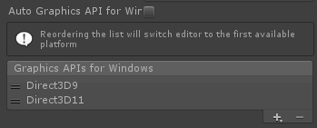
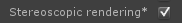

## 原生Stereoscopic Rendering ##
> Note: Currently, setting Unity to render in linear color space breaks stereoscopic rendering. This appears to be a Direct3D limitation. It also appears that the camera.stereoconvergence param has no effect at all if you have some realtime shadows enabled (in forward rendering). In Deferred Lighting, you will get some shadows, but insconsistent between left & right eye.

*窗口模式（在快捷方式中加参数-popupwindow可以去窗口边框）或全屏模式下的设置：

*遇到同步信号不同步时，只要切换一下主显示器即可（3D显示器必须作为主显示器）：

*窗口模式下也可以使用D3D9（在快捷方式中加参数-popupwindow可以去窗口边框）：

