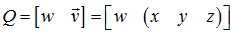
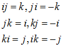
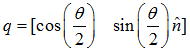
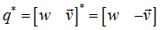
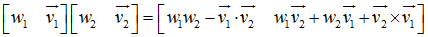
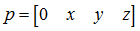
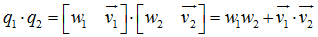

四元数常用于图形学，它是图形学中3种旋转方式之一，其他两种是欧拉角、矩阵（还有一种叫轴-角对，很少用到）

四元数包含一个标量分量和一个三维向量分量：

$Q = w + xi + yj + zk$

<h1>
轴-角对转四元数（左右手法则均适用）（轴${\hat n_a}$-角$\theta_a $对）
</h1>

# 负四元数 #

q和-q代表的旋转是相同的

# 单位四元数 #

意义：应用单位四元数的旋转，方位不改变

单位四元数：$\theta $为360°的整数倍，旋转轴任意

# 四元数的模 #

$\left\| q \right\| = \sqrt {{w^2} + {{\left\| {\vec v} \right\|}^2}}  = \sqrt {{{\cos }^2}\left( {\frac{\theta }{2}} \right) + {{\left( {\sin \left( {\frac{\theta }{2}} \right)\hat n} \right)}^2}}  = \sqrt {{{\cos }^2}\left( {\frac{\theta }{2}} \right) + {{\sin }^2}\left( {\frac{\theta }{2}} \right)}  = 1$

> 模为1的四元数为标准化四元数，只有标准化四元数才能表示旋转

# 四元数共轭和逆 #

${q^{ - 1}} = \frac{{{q^*}}}{{\left\| q \right\|}}$

当使用标准化四元数时：

${q^{ - 1}} = {q^*}$
，
其中q和${q^*}$代表相反的角位移

# 四元数乘法（叉乘）的标准化定义 #

# 运算法则 #

(ab)c=a(bc)

ab≠ba

$\left\| {ab} \right\| = \left\| a \right\|\left\| b \right\|$

${\left( {ab} \right)^{ - 1}} = {b^{ - 1}}{a^{ - 1}}$

对3D点p（）应用旋转：

$p' = qp{q^{ - 1}}$

先进行a旋转再进行b旋转等价于执行ba旋转（图形学对四元数乘法定义进行了修改——$p' = {q^{ - 1}}pq$，使之运算顺序与旋转发生顺序一致，这比坚持正式标准更加重要）

$\left( {\Delta q} \right){q_0} = {q_1} \Rightarrow \Delta q = {q_1}q_0^{ - 1}$

$slerp\left( {{q_0},{q_1},t} \right) = {q_0}{\left( {{q_1}q_0^{ - 1}} \right)^t}$

图形学中的slerp：

$slerp\left( {{q_0},{q_1},t} \right) = \frac{{\sin \left( {1 - t} \right)\theta }}{{\sin \theta }}{q_0} + \frac{{\sin t\theta }}{{\sin \theta }}{q_1}$
 其中$\cos \theta  = {q_1} \cdot {q_2}$

# 四元数对数和指数 #
四元数的指数总是返回标准化四元数

$\exp \left( {\log q} \right) = q$

# 四元数求幂的数学定义 #

${q^t} = \exp \left( {t\log q} \right)$
 例子：${q^{1/3}}$的意义是q的1/3的角位移

